### Hi there 👋

I have conducted in-depth research on DiT, VideoGen, DigitalHuman, Multimodal etc.

#### VibeCoding Projects

* 🎬 [**Subtitle Remover**](https://github.com/ykk648/subtitle_remover) — 自动化的视频字幕提取与移除工具。
* 🔍 [**Duix-Mobile-reverse**](https://github.com/ykk648/Duix-Mobile-reverse) — Duix 移动端应用的逆向分析与接口研究。

<!--
ref https://github.com/marketplace/actions/github-readme-stats-action

**ykk648/ykk648** is a ✨ _special_ ✨ repository because its `README.md` (this file) appears on your GitHub profile.

Here are some ideas to get you started:

- 🔭 I’m currently working on ...
- 🌱 I’m currently learning ...
- 👯 I’m looking to collaborate on ...
- 🤔 I’m looking for help with ...
- 💬 Ask me about ...
- 📫 How to reach me: ...
- 😄 Pronouns: ...
- ⚡ Fun fact: ...
-->

<!-- 
 -->
